# SmartRute Bengkulu 🚦📍
SmartRute Bengkulu adalah aplikasi berbasis web yang dirancang untuk membantu masyarakat Kota Bengkulu dalam menentukan rute tercepat dan terhindar dari kemacetan lalu lintas. Aplikasi ini menggunakan data lalu lintas dan kecerdasan buatan dengan model Random Forest Classifier untuk memberikan prediksi kemacetan dan navigasi yang efisien.
---

## 🎯 1. Tujuan Proyek
Proyek ini dibuat sebagai bagian dari pengembangan sistem Smart City untuk mendukung kenyamanan mobilitas warga Kota Bengkulu. Dengan memanfaatkan teknologi AI, pengguna dapat memperoleh rute optimal berdasarkan kondisi lalu lintas terkini, sehingga dapat menghemat waktu dan menghindari titik-titik rawan macet.
---

## 🚀 2. Fitur Utama
- Prediksi kemacetan berdasarkan input waktu dan lokasi
- Visualisasi peta interaktif dengan penanda zona rawan macet
- Rekomendasi rute tercepat menggunakan algoritma pencarian jalur
- Antarmuka responsif dan mudah digunakan
---

## 🧠 3. Model AI - Random Forest Classifier
Random Forest adalah algoritma ensemble learning berbasis Decision Tree yang memiliki keunggulan:
- Akurasi tinggi untuk data klasifikasi
- Mengurangi risiko overfitting
- Mampu menangani data dengan fitur numerik dan kategorikal
- Efisien dalam pelatihan dan prediksi
---

## 🛠 4. Teknologi yang Digunakan
Proyek SmartRute Bengkulu merupakan integrasi antara teknologi web, pemrosesan geospasial, dan kecerdasan buatan (AI). Berikut adalah rincian teknologi yang digunakan dalam pengembangan sistem ini:

### 🔙 Backend

- *Bahasa*: Python
- *Framework*: [FastAPI](https://fastapi.tiangolo.com/)  
  Digunakan sebagai framework backend untuk membangun REST API yang ringan, cepat, dan responsif. FastAPI menangani permintaan prediksi kemacetan dan penyajian data rute ke frontend.
- *Model AI*: Random Forest Classifier  
  Model pembelajaran mesin berbasis pohon keputusan untuk memprediksi tingkat kemacetan berdasarkan fitur waktu dan geospasial.

### 🌐 Frontend

- *HTML/CSS/JavaScript*  
  Digunakan untuk merancang antarmuka pengguna yang responsif dan intuitif.
- *[Leaflet.js](https://leafletjs.com/)*  
  Library JavaScript open-source untuk menampilkan peta interaktif di browser. Leaflet digunakan untuk:
  - Menampilkan jaringan jalan di Kota Bengkulu
  - Menunjukkan rute yang direkomendasikan berdasarkan hasil prediksi AI
  - Memberi warna berbeda untuk jalan macet, lancar, dan alternatif

### 🧠 Model AI

- *Random Forest Classifier*  
  Algoritma ensemble yang menggabungkan banyak pohon keputusan untuk melakukan klasifikasi tingkat kemacetan. Model ini dilatih menggunakan data simulasi berbasis panjang ruas jalan, dan dapat dikembangkan dengan data real-time.
- *Library*: scikit-learn  
  Proses pelatihan, validasi, dan penyimpanan model dilakukan menggunakan scikit-learn.

### 🗺 Visualisasi Peta & Data Geospasial

- *Leaflet + GeoJSON*  
  Peta divisualisasikan menggunakan Leaflet dan data jalan diambil dari OpenStreetMap. Informasi rute direpresentasikan dalam format GeoJSON yang dapat ditampilkan secara dinamis berdasarkan hasil prediksi.
- *OSMnx*  
  Library Python untuk mengunduh dan memproses data geospasial dari OSM. Digunakan untuk mengambil data jaringan jalan Kota Bengkulu dan menyimpannya dalam format .graphml.

### 🧾 Dataset

- *Data Geospasial*:  
  - Sumber: OpenStreetMap  
  - Format: GraphML (bengkulu.graphml)  
  - Konten: Data simpul dan ruas jalan (termasuk panjang, konektivitas, dan koordinat)
  
- *Data Lalu Lintas (Latih Model)*:  
  - Bentuk: Dataset simulasi berbasis panjang ruas jalan  
  - Label: Diberi label macet atau lancar berdasarkan asumsi panjang > 200 meter  
  - Sumber: Simulasi, scraping, atau observasi lapangan sederhana
---

 ## ⿣ Alur Kerja Sistem
### 🔁 Deskripsi Singkat

SmartRute Bengkulu bekerja sebagai sistem berbasis web yang menggabungkan data geospasial dengan model kecerdasan buatan (AI) untuk memprediksi kondisi lalu lintas dan merekomendasikan rute tercepat. Proses dimulai dari input lokasi awal dan tujuan oleh pengguna, dilanjutkan dengan pencarian rute berdasarkan kondisi jalan, dan berakhir dengan visualisasi rute yang dianotasi (lancar, macet, alternatif).

### 🧭 Alur Umum Sistem:

1. *Input Lokasi*: Pengguna memasukkan lokasi awal dan tujuan.
2. *Pemetaan Rute*: Sistem memetakan jaringan jalan menggunakan data dari OpenStreetMap (GraphML).
3. *Prediksi Kemacetan*: Model AI (Random Forest Classifier) memprediksi tingkat kemacetan setiap ruas jalan.
4. *Penentuan Rute Terbaik*: Algoritma mencari rute tercepat yang menghindari ruas jalan macet.
5. *Visualisasi Peta*: Leaflet.js menampilkan rute pada peta dengan warna berbeda sesuai kondisi lalu lintas.

## 🧭 Diagram Alur Sistem

### 📁 Struktur Folder Proyek
smartrute/
│
├── _pycache_/             # Folder auto-generated untuk cache Python bytecode
│
├── cache/                   # Folder penyimpanan sementara atau data hasil proses
│
├── about.html               # Halaman HTML untuk informasi tentang aplikasi
│
├── bengkulu.graphml         # File data graf wilayah (peta rute), format GraphML
│
├── index.html               # Halaman utama antarmuka pengguna
│
├── main.py                  # File utama Python untuk menjalankan aplikasi
│
├── navigation_map.html      # Halaman HTML untuk menampilkan peta navigasi
│
├── requirements.txt         # Daftar dependensi Python yang diperlukan
│
└── rf_model.pkl             # Model machine learning yang diserialisasi (format Pickle)
---
## 🔮 Pengembangan Lanjutan

SmartRute Bengkulu terus dikembangkan agar lebih bermanfaat dan efisien dalam mendukung mobilitas masyarakat. Beberapa fitur pengembangan ke depan:

### 🧠 1. Integrasi Data Real-Time
- Menggunakan data lalu lintas real-time dari:
  - Sensor jalan
  - API Google Maps
  - Data dari Dinas Perhubungan (Dishub)
- Sistem akan memperbarui rute secara otomatis jika terjadi kecelakaan atau penutupan jalan.

### 📲 2. Aplikasi Mobile
- Mengembangkan aplikasi versi Android dan iOS.
- Menggunakan framework multiplatform seperti:
  - Flutter
  - React Native
- Memungkinkan pengguna mengakses informasi rute saat bepergian.

### 📈 3. Analisis Lalu Lintas
- Menyediakan *dashboard statistik* untuk:
  - Menganalisis pola kemacetan
  - Melihat volume kendaraan
  - Melacak waktu tempuh rata-rata
- Data ini dapat digunakan sebagai *dasar pengambilan kebijakan* oleh pemerintah daerah.

### 🔍 4. Rekomendasi Waktu Terbaik
- Fitur saran *jam keberangkatan optimal* berdasarkan prediksi kepadatan lalu lintas historis dan real-time.

### 🌐 5. Multi-Kota & Skalabilitas
- Perluasan cakupan layanan ke wilayah lain di *Provinsi Bengkulu*.
- Sistem dibangun berbasis *modular* agar dapat diadaptasi untuk kota lain dengan cepat.

### 👥 6. Sistem Akun Pengguna
- Fitur akun pengguna:
  - Simpan lokasi favorit
  - Riwayat perjalanan
  - Notifikasi kondisi lalu lintas
- Memberikan pengalaman yang lebih personal.

### 🔐 7. Keamanan & Privasi
- Implementasi fitur keamanan seperti:
  - Otentikasi pengguna
  - Enkripsi data
  - Pengaturan privasi sesuai standar industri

---

## 👨‍💻 Tim Pengembang

| Nama                      | NPM        |
|---------------------------|------------|
| Rayhan Muhammad Adha     | G1A023051  |
| Aulia Dwi Rahmadani       | G1A023043  |
| Nadya Alicia Putri        | G1A023019  |

*Program Studi*: Teknik Informatika  
*Universitas*: Universitas Bengkulu  
*Dosen Pembimbing*: Ir. Arie Vatresia, S.T., M.T.I., Ph.D

---
